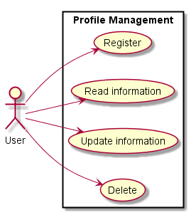
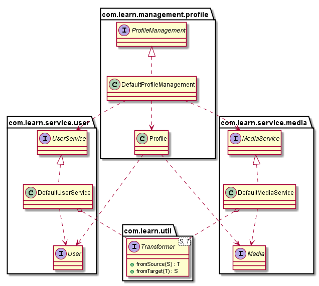
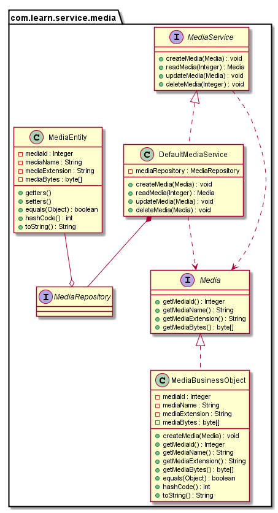
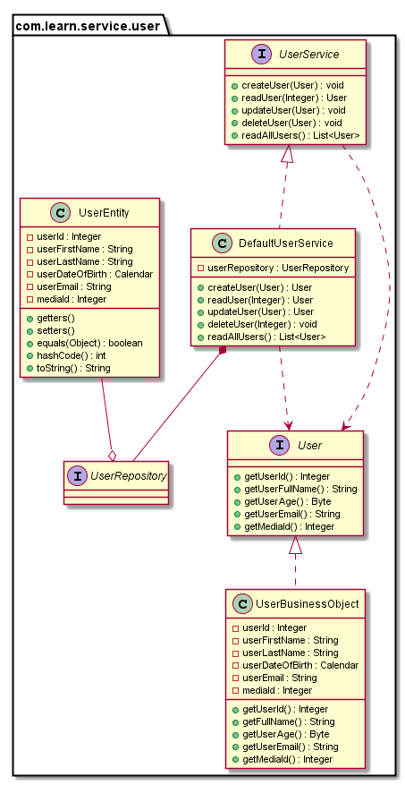
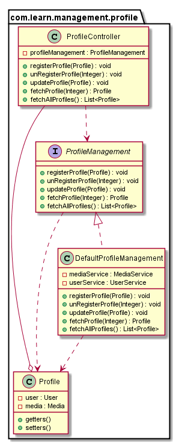

= Prepare your self for software engineering concepts and technologies

== Build Status

TODO

== Use Case

. User profile
[TIP]
Almost no application now don't have a user profile so we picked it as our first use case. User can create profile that consists of simple user information and his profile picture.
  

== Technologies

. JUnit
. Hamcrest
. Mockito
. JBehave

== Principals

. TDD
[TIP]
Test-driven development is a software development process that relies on the repetition of a very short development cycle: first the developer writes an (initially failing) automated test case that defines a desired improvement or new function, then produces the minimum amount of code to pass that test, and finally refactors the new code to acceptable standards.
. SOLID
[TIP]
Single Responsibility Principal states that every class should have responsibility over a single part of the functionality provided by the software, and that responsibility should be entirely encapsulated by the class. All its services should be narrowly aligned with that responsibility.
[TIP]
Open/Closed Principal states "software entities (classes, modules, functions, etc.) should be open for extension, but closed for modification"; such an entity can allow its behavior to be extended without modifying its existing functionality/source code.
[TIP]
Liskov Substitution Principal in a computer program, if S is a subtype of T, then objects of type T may be replaced with objects of type S (i.e., objects of type S may substitute objects of type T).
[TIP]
Interface Segregation Principal states that no client should be forced to depend on methods it does not use.
[TIP]
Dependency Inversion High-level modules should not depend on low-level modules. Both should depend on abstractions. Abstractions should not depend on details. Details should depend on abstractions.
. KISS
[TIP]
Keep It Stupid Simple
. YAGNI
[TIP]
You Ant Gonna Need It
. Aggregation
[TIP]
A "uses" B = Aggregation : B exists independently (conceptually) from A
. Composition
[TIP]
A "owns" B = Composition : B has no meaning or purpose in the system without A
. Package By Feature
[TIP]
Package-by-feature uses packages to reflect the feature set. It places all items related to a single feature (and only that feature) into a single directory/package. This results in packages with high cohesion and high modularity, and with minimal coupling between packages. Items that work closely together are placed next to each other.

== Steps

. Created the project link:pom.xml[] file
[source,xml]
  <?xml version="1.0" encoding="UTF-8"?>
  <project xmlns="http://maven.apache.org/POM/4.0.0"
           xmlns:xsi="http://www.w3.org/2001/XMLSchema-instance"
           xsi:schemaLocation="http://maven.apache.org/POM/4.0.0
           http://maven.apache.org/xsd/maven-4.0.0.xsd">
      <modelVersion>4.0.0</modelVersion>
      <groupId>com.learn</groupId>
      <artifactId>prepare-your-self</artifactId>
      <version>1.0-SNAPSHOT</version>
  </project>

. Created the needed folder for our project link:src/main/java/com/learn[] and link:src/test/java/com/learn[]

. Designed the class diagram of our use case
  
  
  
  

. Added the Junit dependency to the maven pom file.
[source,xml]
  <dependency>
      <groupId>junit</groupId>
      <artifactId>junit</artifactId>
      <version>4.12</version>
      <scope>test</scope>
  </dependency>

. Added the Mockito dependency to the maven pom file.
[source,xml]
  <dependency>
      <groupId>org.mockito</groupId>
      <artifactId>mockito-core</artifactId>
      <version>1.10.19</version>
      <scope>test</scope>
  </dependency>

. Added Google Guava dependency to the maven pom file.
[source,xml]
    <dependency>
        <groupId>com.google.guava</groupId>
        <artifactId>guava</artifactId>
        <version>18.0</version>
    </dependency>

. Added JBehave dependency to the maven pom file.
[source,xml]
    <dependency>
            <groupId>org.jbehave</groupId>
            <artifactId>jbehave-spring</artifactId>
            <version>${jbehave.core-version}</version>
        </dependency>
        <dependency>
            <groupId>org.jbehave</groupId>
            <artifactId>jbehave-core</artifactId>
            <version>${jbehave.core-version}</version>
            <classifier>resources</classifier>
            <type>zip</type>
        </dependency>
        <dependency>
            <groupId>org.jbehave.site</groupId>
            <artifactId>jbehave-site-resources</artifactId>
            <version>${jbehave.site-version}</version>
            <type>zip</type>
        </dependency>

. Added JBehave maven plugin to run the stories.
[source,xml]
        <plugin>
            <groupId>org.jbehave</groupId>
            <artifactId>jbehave-maven-plugin</artifactId>
            <version>${jbehave.core-version}</version>
            <executions>
                <execution>
                    <id>unpack-view-resources</id>
                    <phase>process-resources</phase>
                    <goals>
                        <goal>unpack-view-resources</goal>
                    </goals>
                </execution>
                <execution>
                    <id>embeddable-stories</id>
                    <phase>integration-test</phase>
                    <configuration>
                        <includes>
                            <include>**/*Stories.java</include>
                        </includes>
                        <excludes/>
                        <ignoreFailureInStories>true</ignoreFailureInStories>
                        <ignoreFailureInView>false</ignoreFailureInView>
                        <threads>1</threads>
                        <metaFilters>
                            <metaFilter/>
                        </metaFilters>
                    </configuration>
                    <goals>
                        <goal>run-stories-as-embeddables</goal>
                    </goals>
                </execution>
            </executions>
        </plugin>

. Added maven compiler plugin to the plugin managment to force the java version.
[source,xml]
        <plugin>
            <groupId>org.apache.maven.plugins</groupId>
            <artifactId>maven-compiler-plugin</artifactId>
            <version>3.2</version>
            <configuration>
                <source>${java-version}</source>
                <target>${java-version}</target>
            </configuration>
        </plugin>

. Added maven resource plugin to filter resources and execlude the java classes.
[source,xml]
        <resources>
            <resource>
                <directory>src/main/java</directory>
                <filtering>true</filtering>
                <excludes>
                    <exclude>**/*.java</exclude>
                </excludes>
            </resource>
            <resource>
                <directory>src/main/resources</directory>
                <filtering>true</filtering>
            </resource>
        </resources>

. Started writing unit tests for the low level services, the method naming takes BDD style GIVEN, WHEN, THEN and any other services outside the tested services should be mocked.
[source,java]
  public class DefaultUserServiceCreateUserTest {
      ...
      @BeforeClass
      public static void setUp() {
          UserRepository userRepository = mock(UserRepository.class);
          userService = new DefaultUserService();
          ((DefaultUserService) userService).setUserRepository(userRepository);
          doReturn(buildValidUser()).
                  when(userRepository.save(buildValidUserEntity()));
      }
      ...
      @Test
      public void givenValidUserObjectWhenCreateUserThenUserIsStored() {
          User user = userService.createUser(
                  UserBusinessObject.newBuilder()
                          .userFirstName(validUserFirstName)
                          .userEmail(validUserEmail)
                          .build()
          );
          assertThat(user, equalTo(buildValidUser()));
      }
      ...
  }

. Started writing behaviour tests for high level services (also called management or application services), we are here testing the high level features.
[source, java]
  public class DefaultProfileManagementUpdateProfile {
      ...
      @Given("valid user and no media for profile update")
      public void givenValidUserAndNoMediaForProfileUpdate() {
          testProfile = Profile.newBuilder()
                  .user(
                          UserBusinessObject.newBuilder()
                                  .userId(validUserId)
                                  .userFirstName(validUserFirstName)
                                  .userEmail(validUserEmail)
                                  .build()
                  ).build();
      }
      @When("update profile with valid user and no media")
      public void whenUpdateProfileWithValidUserAndNoMedia() {
          profileManagement.updateProfile(testProfile);
      }
      @Then("profile with valid user and no media updated")
      public void thenProfileWithValidUserAndNoMediaUpdated() {
          assertThat(buildValidProfileWithoutMedia(), equalTo(testProfile));
      }
      ...
  }

== References

* http://www.javapractices.com/topic/TopicAction.do?Id=205[]
* http://java.dzone.com/articles/package-your-classes-feature[]
* http://plantuml.sourceforge.net/[]
* http://www.infoq.com/articles/ddd-in-practice[]
* http://www.tutorialspoint.com/design_pattern[]
