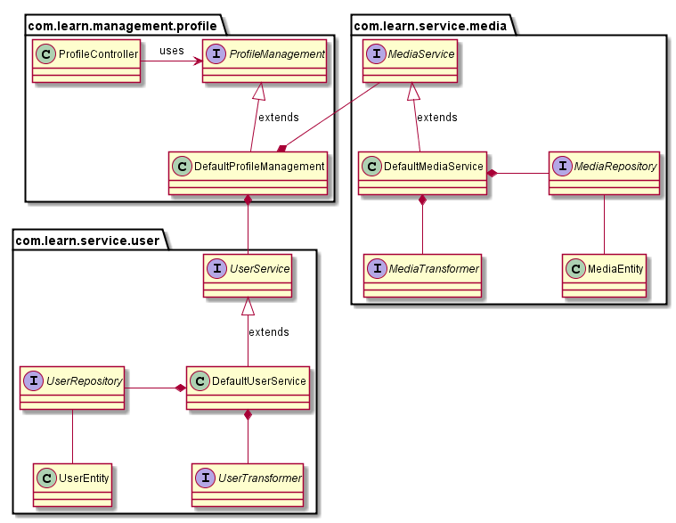

= Prepare your self for software engineering concepts and technologies

== Use Case

. User profile
[TIP]
Almost no application now don't have a user profile so we picked it as our first use case.

== Technologies

. JUnit
. Hamcrest
. Mockito
. JBehave

== Principals

. TDD
. SOLID
. KISS
[TIP]
Keep It Stupid Simple
. YAGNI
[TIP]
You Ant Gonna Need It
. Aggregation
[TIP]
A "uses" B = Aggregation : B exists independently (conceptually) from A
. Composition
[TIP]
A "owns" B = Composition : B has no meaning or purpose in the system without A
. Package By Feature
[TIP]
Package-by-feature uses packages to reflect the feature set. It places all items related to a single feature (and only that feature) into a single directory/package. This results in packages with high cohesion and high modularity, and with minimal coupling between packages. Items that work closely together are placed next to each other.

== Steps

. Created the project link:pom.xml[] file
[source,xml]
  <?xml version="1.0" encoding="UTF-8"?>
  <project xmlns="http://maven.apache.org/POM/4.0.0"
           xmlns:xsi="http://www.w3.org/2001/XMLSchema-instance"
           xsi:schemaLocation="http://maven.apache.org/POM/4.0.0
           http://maven.apache.org/xsd/maven-4.0.0.xsd">
      <modelVersion>4.0.0</modelVersion>
      <groupId>com.learn</groupId>
      <artifactId>prepare-your-self</artifactId>
      <version>1.0-SNAPSHOT</version>
  </project>

. Created the needed folder for our project link:src/main/java/com/learn[] and link:src/test/java/com/learn[]

. Implemented the empty class diagram 

. Added the Junit dependency to the maven pom file.
[source,xml]
  <dependency>
      <groupId>junit</groupId>
      <artifactId>junit</artifactId>
      <version>4.12</version>
      <scope>test</scope>
  </dependency>

. Added the Mockito dependency to the maven pom file.
[source,xml]
  <dependency>
      <groupId>org.mockito</groupId>
      <artifactId>mockito-core</artifactId>
      <version>1.10.19</version>
      <scope>test</scope>
  </dependency>

== References

* http://java.dzone.com/articles/package-your-classes-feature[]
* http://plantuml.sourceforge.net/[]
* http://www.infoq.com/articles/ddd-in-practice[]
* http://www.tutorialspoint.com/design_pattern[]
